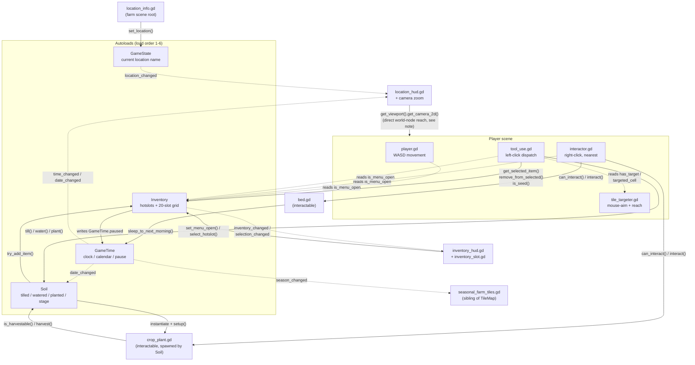

# Demo 3 — Code Review Notes (2026-08-21)

This note summarizes a pass over `demo-3` that compared the existing `GAME_SYSTEMS_SUMMARY.md` against the actual `.gd` scripts and `.tscn` scenes, added explanatory header/inline comments to every script, and maps out how the game's systems call into each other. It's meant to sit alongside `GAME_SYSTEMS_SUMMARY.md`, not replace it — that file remains the authoritative feature-by-feature reference.

## What was checked

Every `.gd` script (18 files across `autoload/`, `farming/`, `interactables/`, `inventory/`, `locations/`, `player/`, and `ui/`), `project.godot`, and the scenes for the player, bed, crop, both HUDs, and the four seasonal farm maps were read in full and checked line-by-line against the corresponding description in `GAME_SYSTEMS_SUMMARY.md`.

The result: the documentation is unusually accurate and detailed — nearly everything it describes (signal names, collision layers, stack rules, crop stages, input mapping, node structure) matches the code exactly. One gap was found.

## Documentation gap #1: item-placement priority changed mid-review

While this review was in progress, `autoload/inventory.gd` was edited (the placement logic behind `try_add_item()` was reworked into a `_plan_add_item()`/`_apply_add_plan()` pair). The new behavior is a real gameplay change, not just a refactor:

- **Old rule** (still what `GAME_SYSTEMS_SUMMARY.md` section 17 describes): top up matching stacks first, then fill empty *inventory* (backpack) slots — "Harvested produce never automatically enters hotslots."
- **New rule** (current code): top up matching stacks first (hotslots, then inventory), then fill empty slots preferring the **currently selected hotslot**, then the rest of the hotslots, then the backpack grid.

In practice this means a freshly harvested crop, or any newly-picked-up item, can now land directly in whichever hotslot the player currently has selected, if that slot is empty — something the documentation explicitly says doesn't happen. This is worth a deliberate decision: either update section 17 of `GAME_SYSTEMS_SUMMARY.md` to describe the new priority, or revert the placement order if the old backpack-first behavior was intentional. I did not change the new logic — only added comments describing it — since this looked like an intentional in-progress edit rather than something to review-and-revert.

## Documentation gap #2: camera zoom

`ui/location_hud.gd` and `ui/location_hud.tscn` contain a working camera-zoom control — a `-` button, a percentage label, and a `+` button, stepping the Player's `Camera2D` zoom between 60% and 120% in 10% increments — that is not mentioned anywhere in `GAME_SYSTEMS_SUMMARY.md`. File timestamps show this was added after the document's last audit (2026-08-14); today's date is 2026-08-21. I've added a short section 39 addendum plus an update to section 7 in `GAME_SYSTEMS_SUMMARY.md` describing it, and a full explanatory comment block directly in `ui/location_hud.gd`.

Worth flagging architecturally: this is the only place in the project where a HUD script reaches directly into a *world* node (`get_viewport().get_camera_2d()`) instead of only listening to autoload signals, which is otherwise a consistent rule across every other UI script. It's a reasonable exception for a presentation-only zoom control, but it's the one spot that breaks the "HUD only renders autoload state" pattern documented as the project's architecture rule.

Everything else — Inventory, Soil, GameTime, GameState, the interactable framework, seasonal tile swapping, crop lifecycle, and every `.tscn` node structure — matched the documentation with no discrepancies found.

## Code comments added

Every `.gd` file now has:

- A file-level header comment explaining what the script owns, where it sits in the architecture (autoload vs. scene-attached vs. dynamically spawned), and — most importantly — **which other scripts call into it or listen to its signals**, by name.
- Inline comments on the less-obvious logic: the transactional harvest check in `Soil.harvest()`, why `sleep_to_next_morning()` must not re-emit `date_changed`, why tool consumption happens *after* `Soil.plant()` succeeds, why crop objects hold no state of their own, etc.

No gameplay logic was changed. A line-by-line diff against the original files (ignoring blank lines and comments) confirms every script is functionally identical — the only structural change was in `autoload/soil.gd`, where two `preload()` constants were moved a few lines earlier in the file purely for readability; this has no effect on behavior.

## How the systems link together

The diagram below traces every cross-script call and signal connection in the project. Solid arrows are direct method calls; dashed arrows are signal subscriptions.

A few links worth calling out explicitly, since they're easy to miss reading any single file in isolation:

- **Harvest is a chain across three scripts**: `interactor.gd` (right-click, finds nearest) → `crop_plant.gd` (`interact()`, checks maturity) → `soil.gd` (`harvest()`, the actual state change) → `inventory.gd` (`try_add_item()`, the gate that can make the whole harvest fail if the inventory is full).
- **Sleeping and midnight are the same code path**: both `bed.gd`'s `interact()` and `game_time.gd`'s own minute-rollover call `_advance_day()`, which is what fires `date_changed`, which is what `soil.gd` listens to for daily crop growth and the water reset. There is no separate "sleep" logic for gameplay state — only the clock-snapping in `sleep_to_next_morning()` is sleep-specific.
- **The inventory pause is a direct field write, not a signal**: `inventory.gd`'s `set_menu_open()` sets `GameTime.paused` directly. That's the *only* thing in the project that can pause `GameTime`, which is called out in both documents as a risk if a second pause reason (dialogue, cutscenes, etc.) is ever added later.
- **Left-click and right-click are fully separate systems that never call each other**: `tool_use.gd` (left-click, cursor-aimed via `tile_targeter.gd`) handles till/water/plant; `interactor.gd` (right-click, proximity-aimed) handles bed and harvest. Nothing routes between them.
- **Crop objects are disposable by design**: `crop_plant.gd` stores only a cell reference; every visual it shows is re-derived from `soil.gd` on demand. This is why `soil.gd` can freely `queue_free()` and respawn crop instances (e.g. when the TileMap is rebuilt) without any farming progress being lost.

## Suggested next step

If this addendum approach is useful, the natural follow-up would be folding the camera-zoom description permanently into `GAME_SYSTEMS_SUMMARY.md`'s main sections on the next full audit pass, and removing the section 39 addendum once merged — matching the document's own stated policy of staying current as systems change.
